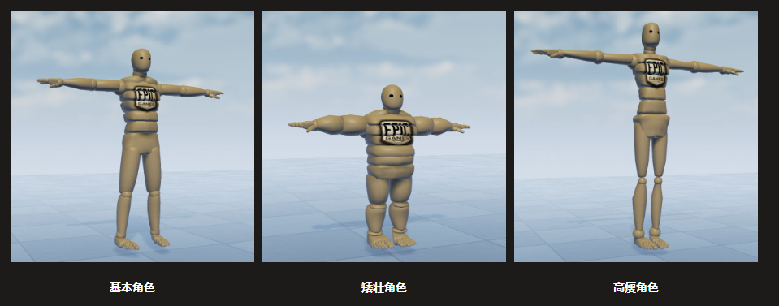
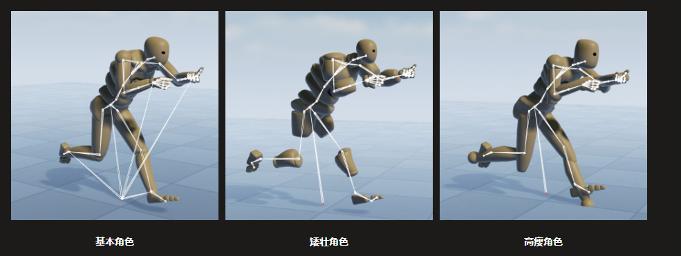
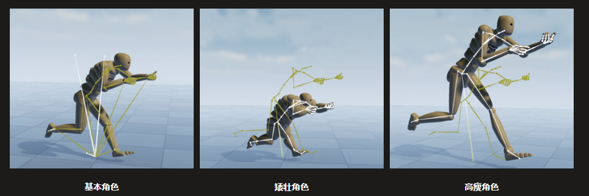

- [动画重定向](#动画重定向)
  - [动画重定位效果](#动画重定位效果)
    - [动画重定位前效果](#动画重定位前效果)
    - [动画重定位后效果](#动画重定位后效果)
  - [动画重定位原理](#动画重定位原理)

# 动画重定向
动画重定向是一种允许在相同骨架资源但是比例差异很大的角色之间复用动画的功能。
通过重定向可以防止生成动画的骨架在使用来自不同外形的角色的动画时丢失比例或产生不必要的变形。
通过动画重定向还可以在使用不同骨架资源之间共享动画，前提是他们使用相似的骨骼层级，并使用绑定的共享资源在骨架之间传递数据。
## 动画重定位效果
假如有多个角色，希望在基本角色、矮壮角色和高瘦角色之间共享动画。

### 动画重定位前效果
在应用重定位前，可以在任何相同骨架资源的骨骼网格之间使用动画。但是如果在角色身材比例上面有所差异，就会得到一些难看的效果。

### 动画重定位后效果
对角色应用重定向后，系统将不再考虑他们的比例差异，动画会在每个角色身上正常播放。

## 动画重定位原理
动画绑定到骨架资源，**骨架资产实际上其实就是一个骨骼名称和层次结构数据的列表**，但他也储存了来自用于定义骨架资产的原始骨骼网格的**初始比例**。此数据是以骨骼平移数据的形式存储的。
> 特别要注意的是，重定向系统只会重定向骨骼的平移分量。骨骼的旋转始终来自动画数据。

因为使用了原始骨骼网格定义骨架资产的比例，所以使用该骨架资产但有不同比例的其他任何骨骼网格(例如比原始网格短的多的网格)都需要经过重定位才能正确工作，如果不经过这一步，具有不同比例的骨骼网格会尝试使用原始网格的平移数据，导致上面的错误。

为了解决这个问题，骨架编辑器中的骨架树提供了几个设置，用于更改骨骼之间平移重定位的方式
> 
> * Animation(动画)--骨骼平移来自于动画数据，不做更改。
> * Skeleton(骨架)--骨骼平移来自于目标骨架的绑定姿势。
> * AnimationScaled(比例动画)--骨骼平移来自动画数据，但按骨架的比例调整，目标骨架(播放动画的骨架)与源骨架(制作动画的骨架)的骨骼长度之比。

对于动画重定位，使用重定位和非重定位没有显著的性能差异。使用动画重定位的好处是增加独特角色的数量，又不必创建全新的一套匹配动画，重新做动画会严重占用动画存储预算。

[官方文档](https://docs.unrealengine.com/4.27/zh-CN/AnimatingObjects/SkeletalMeshAnimation/AnimationRetargeting/)
[骨骼重定向具体步骤](https://blog.csdn.net/qq_39934403/article/details/120842297)