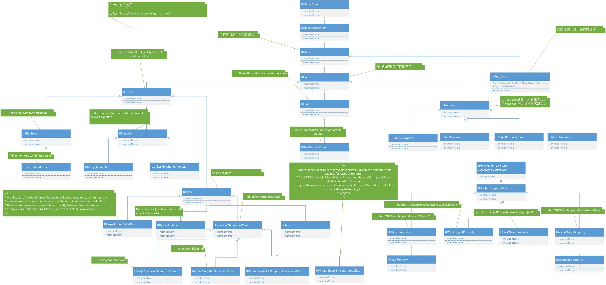

# UE4反射机制原理剖析

1. UObject是整个反射系统的核心，包括C++类，结构体，函数，成员变量以及枚举，也支持TArray(只支持一些如TArray和TSubclassof()的模板类型，并且他们的模板类型不能是嵌套的类型)，**但是不支持TMap**。

2.  反射的支持离不开上面图片中的类，比如 UClass,UBlueprintGeneratedClass,UFunction,UEnum以及UProperty以及他们的子类。

3. 每一个继承UObject且支持反射系统类型都有一个相对应的UClass。
4. UMetaDate是元数据，它储存了一些编辑器需要的额外信息，比如他的分类(Gategory)、提示(Tooltip)等，最终打包的时候是不会用到这些信息的。

5. 反射系统里需要访问的float，int32等变量，则是由继承自UProerty的子类来表示的。

## 用一个例子去看反射系统

创建一个名为ReflectionStudy的工程。
里面一般分为几类文件：
* ReflectionStudy.generated.cpp:一个工程只有一个，这个文件是用来为每个支持反射的类生成反射信息的代码，比如注册属性、添加源数据等。
* ReflectionStudy.generated.dep.h:这个文件是用来包含ReflectionStudy.generated.cpp用到的头文件。
* ReflectionStudyClasses.h
* ****.generated.这个就是为每个支持反射的头文件生成的对应的宏的代码。

### 类定义

~~~c++
// Fill out your copyright notice in the Description page of Project Settings.

 #pragma once
 #include "GameFramework/GameMode.h"
 #include "ReflectionStudyGameMode.generated.h"
/**
 * 
 */
UCLASS()
class REFLECTIONSTUDY_API AReflectionStudyGameMode : public AGameMode
{
	GENERATED_BODY()
	
	
protected:
	UPROPERTY(BlueprintReadWrite, Category = "AReflectionStudyGameMode")
	float Score;

	UFUNCTION(BlueprintCallable, Category = "AReflectionStudyGameMode")
	void CallableFuncTest();

	UFUNCTION(BlueprintNativeEvent, Category = "AReflectionStudyGameMode")
	void NavtiveFuncTest();

	UFUNCTION(BlueprintImplementableEvent, Category = "AReflectionStudyGameMode")
	void ImplementableFuncTest();
};
~~~

### UHT生成的.generated.h文件

ReflectionStudyGameMode.generated.h部分代码
~~~c++
 #define ReflectionStudy_Source_ReflectionStudy_ReflectionStudyGameMode_h_14_RPC_WRAPPERS_NO_PURE_DECLS \
	virtual void NavtiveFuncTest_Implementation(); \
 \
	DECLARE_FUNCTION(execNavtiveFuncTest) \
	{ \
		P_FINISH; \
		P_NATIVE_BEGIN; \
		this->NavtiveFuncTest_Implementation(); \
		P_NATIVE_END; \
	} \
 \
	DECLARE_FUNCTION(execCallableFuncTest) \
	{ \
		P_FINISH; \
		P_NATIVE_BEGIN; \
		this->CallableFuncTest(); \
		P_NATIVE_END; \
	}
~~~
* UHT帮我们自动生成了如上代码，之所以生成的每个函数前面有一个exec前缀，是因为UE4蓝图调用约定。

#### exec前缀函数

* C++直接调用或者蓝图的实现中调用C++默认版本(类似于C++虚函数的重载时，经常会调用一下父类函数)，都会先调用这个exec版本，最终调用到_Implementation后缀的版本。
* exec版本函数是由DECLARE_FUNCTION这个宏展开
~~~c++
 #define DECLARE_FUNCTION(func) static void func( UObject* Context, FFrame& Stack, RESULT_DECL )
~~~
可见这些类成员函数最终会对应一个exec版本的静态成员函数，具体展开结果如下
~~~c++
static void execNavtiveFuncTest( UObject* Context, FFrame& Stack, void*const Z_Param__Result )
{
    Stack.Code += !!Stack.Code;

    {
        SCOPED_SCRIPT_NATIVE_TIMER(ScopedNativeCallTimer);

        // ThisClass 是个 typedef, 是在后面的宏里定义的，在这里就是 AMyAcotr
        ((ThisClass*)(Context))->NavtiveFuncTest_Implementation();
    }
}
~~~
~~~c++
 #define ReflectionStudy_Source_ReflectionStudy_ReflectionStudyGameModeBase_h_15_GENERATED_BODY_LEGACY \
PRAGMA_DISABLE_DEPRECATION_WARNINGS \
public: \
	ReflectionStudy_Source_ReflectionStudy_ReflectionStudyGameModeBase_h_15_PRIVATE_PROPERTY_OFFSET \
	ReflectionStudy_Source_ReflectionStudy_ReflectionStudyGameModeBase_h_15_SPARSE_DATA \
	ReflectionStudy_Source_ReflectionStudy_ReflectionStudyGameModeBase_h_15_RPC_WRAPPERS \
	ReflectionStudy_Source_ReflectionStudy_ReflectionStudyGameModeBase_h_15_CALLBACK_WRAPPERS \
	ReflectionStudy_Source_ReflectionStudy_ReflectionStudyGameModeBase_h_15_INCLASS \
	ReflectionStudy_Source_ReflectionStudy_ReflectionStudyGameModeBase_h_15_STANDARD_CONSTRUCTORS \
public: \
PRAGMA_ENABLE_DEPRECATION_WARNINGS
~~~
* PRAGMA_DISABLE_DEPRECATION_WARNINGS / PRAGMA_ENABLE_DEPRECATION_WARNINGS这两个宏是用来开启/关闭编译器过期警告。

~~~c++
 #define ReflectionStudy_Source_ReflectionStudy_ReflectionStudyGameModeBase_h_15_RPC_WRAPPERS_NO_PURE_DECLS \
~~~
* 这个宏里的内容是用来展开我们之前定义的UFUNCTION具体内容如下：
>  * UFUNCTION(BlueprintImplementableEvent)这种函数是用来实现在蓝图中的，由C++进行调用，所以在.generated.h中没有相应的实现。
> * UFUNCTION(BlueprintNAtiveEvent)这种函数蓝图可以进行重写，C++有一份默认实现，由C++进行调用，如果蓝图没有重写，那么就调用C++版本的实现，可以看到.generated.h中对这种函数声明了一个_Implementation结尾的函数，所以需要在cpp中相应的实现_Implementation结尾的函数。
> * 其他的BlueprintSetter/BlueprintGetter/BlueprintCallable/BlueprintPure,这些都会生成一个exec前缀的版本，在这个版本的函数里直接调用了C++版本。

|UFUNCTION标记|C++实现|C++调用|UHT处理|蓝图实现|蓝图调用|
|-|-|-|-|-|-|
|BlueprintPure|在自己的cpp中实现|C++调用直接进入到cpp的实现中|UHT自动生成exec版本|无|蓝图调用后进入到exec的版本中，在进入到native版本|
|BlueprintCallable|在自己的cpp中实现|C++调用直接进入到cpp的实现中|UHT自动生成exec版本|无|蓝图调用后进入到exec的版本中，在进入到native版本|
|BlueprintGetter|在自己的cpp中实现|C++调用直接进入到cpp的实现中|UHT自动生成exec版本|无|蓝图调用后进入到exec的版本中，在进入到native版本|
|BlueprintSetter|在自己的cpp中实现|C++调用直接进入到cpp的实现中|UHT自动生成exec版本|无|蓝图调用后进入到exec的版本中，在进入到native版本|
|BlueprintNativeEvent|自己需要在cpp中实现_Implementation版本，UHT自动生成原版实现|先进入到.gen.cpp的实现中，然后再进入蓝图虚拟机(如果蓝图中有实现)，蓝图中没有实现的话会调用exec版本，然后进入到_Implementation实现中|UHT自动生成原版实现到.gen.cpp中，还会在.generated.h中生成exec版本|可在蓝图中实现重写|可在蓝图中通过Parent调用C++中的版本，这时会进入到exec版本中，然后再进入到_Implementation的实现中|
|BlueprintImplementableEvent|不需要自己去实现，UHT自动生成原版实现|进入到.gen.cpp的实现中，然后再进入到蓝图虚拟机(如果蓝图中有实现)|UHT自动生成原版实现到.gen.cpp中|可在蓝图中实现重写|不能调用|

~~~c++
 #define ReflectionStudy_Source_ReflectionStudy_ReflectionStudyGameMode_h_14_INCLASS \
	private: \
	static void StaticRegisterNativesAReflectionStudyGameMode(); \
	friend REFLECTIONSTUDY_API class UClass* Z_Construct_UClass_AReflectionStudyGameMode(); \
	public: \
	DECLARE_CLASS(AReflectionStudyGameMode, AGameMode, COMPILED_IN_FLAGS(0 | CLASS_Transient | CLASS_Config), 0, TEXT("/Script/ReflectionStudy"), NO_API) \
	DECLARE_SERIALIZER(AReflectionStudyGameMode) \
	/** Indicates whether the class is compiled into the engine */ \
	enum {IsIntrinsic=COMPILED_IN_INTRINSIC};
~~~
* StaticRegisterNativesAReflectionStudyGameMode 这个函数是用来注册c++原生函数暴露给虚拟机使用的。
* friend REFLECTIONSTUDY_API class UClass* Z_Construct_UClass_AReflectionStudyGameMode();声明友元函数，这个函数是用来构建此类对应的UClass的。之后程序运行时，会利用这个结构去收集类的反射信息。
* DECLARE_CLASS 此宏比较复杂，主要是定义了StaticClass()等。需要注意的地方如下：
> * typedef TSuperClass Super;typedef TClass ThisClass;这就是我们经常用的Super定义的地方，还有一个ThisClass，用在之前exec函数定义的地方。
> * inline static UClass *StaticClass();这就是我们经常使用到的，获取一个类的反射信息对象，内部调用的是静态成员函数GetPrivateStaticClass; 
* DECLARE_SERIALIZER 定义序列化代码。
* enum {IsIntrinsic=COMPILED_IN_INTRINSIC} 用来标记这个类是否是编译到引擎中的。
~~~c++
 #define ReflectionStudy_Source_ReflectionStudy_ReflectionStudyGameMode_h_14_ENHANCED_CONSTRUCTORS \
	/** Standard constructor, called after all reflected properties have been initialized */ \
	NO_API AReflectionStudyGameMode(const FObjectInitializer& ObjectInitializer = FObjectInitializer::Get()) : Super(ObjectInitializer) { }; \
private: \
	/** Private copy-constructor, should never be used */ \
	NO_API AReflectionStudyGameMode(const AReflectionStudyGameMode& InCopy); \
public: \
	DECLARE_VTABLE_PTR_HELPER_CTOR(NO_API, AReflectionStudyGameMode); \
DEFINE_VTABLE_PTR_HELPER_CTOR_CALLER(AReflectionStudyGameMode); \
	DEFINE_DEFAULT_OBJECT_INITIALIZER_CONSTRUCTOR_CALL(AReflectionStudyGameMode)
~~~
* ReflectionStudy_Source_ReflectionStudy_ReflectionStudyGameMode_h_14_ENHANCED_CONSTRUCTORS用来生成构造函数的宏；
> GENERATED_BODY 和 GENERATED_UCLASS_BODY的区别
> * GENERATED_UCLASS_BODY->ReflectionStudy_Source_ReflectionStudy_ReflectionStudyGameMode_h_14_STANDARD_CONSTRUCTORS;
>   1. 这个宏里声明了一个构造函数AMyActor(const FObjectInitializer& ObjectInitializer);需要在cpp中添加实现。
>   2. 还实现了一个静态函数static void __DefaultConstructor(const FObjectInitializer& X) { new((EInternal*)X.GetObj())TClass(X); }这个函数调用了一下new，在x.GetObj()返回的内存地址上去构造当前对象。
> * GENERATED_BODY->ReflectionStudy_Source_ReflectionStudy_ReflectionStudyGameMode_h_14_ENHANCED_CONSTRUCTORS和上面的不一样，没有声明带ObjectInitializer参数的构造函数，只是实现了一个静态函数static void __DefaultConstructor(const FObjectInitializer& X) { new((EInternal*)X.GetObj())TClass(X); }
> * 还有个不一样的地方：GENERATED_UCLASS_BODY 展开的最后是 public:，而 GENERATED_UCLASS 展开的最后是 private:，所以在编写头文件时，最好在这个两个宏后面显式加上 public 或 private；
* 	NO_API AReflectionStudyGameMode(const FObjectInitializer& ObjectInitializer = FObjectInitializer::Get()) : Super(ObjectInitializer) { }; \定义一个标志构造函数，在所有反射属性都初始化之后调用。
* NO_API AReflectionStudyGameMode(const AReflectionStudyGameMode& InCopy);防止调用拷贝构造函数
* 	DECLARE_VTABLE_PTR_HELPER_CTOR(NO_API, AReflectionStudyGameMode); \
DEFINE_VTABLE_PTR_HELPER_CTOR_CALLER(AReflectionStudyGameMode); \热加载相关。
* DEFINE_DEFAULT_OBJECT_INITIALIZER_CONSTRUCTOR_CALL(AReflectionStudyGameMode)定义了一个默认构造函数，如下代码：
~~~c++
static void __DefaultConstructor(const FObjectInitializer& X) { new((EInternal*)X.GetObj())TClass(X); }
 #define  ReflectionStudy_Source_ReflectionStudy_ReflectionStudyGameMode_h_14_GENERATED_BODY \
PRAGMA_DISABLE_DEPRECATION_WARNINGS \
public: \
	ReflectionStudy_Source_ReflectionStudy_ReflectionStudyGameMode_h_14_RPC_WRAPPERS_NO_PURE_DECLS \
	ReflectionStudy_Source_ReflectionStudy_ReflectionStudyGameMode_h_14_CALLBACK_WRAPPERS \
	ReflectionStudy_Source_ReflectionStudy_ReflectionStudyGameMode_h_14_INCLASS_NO_PURE_DECLS \
	ReflectionStudy_Source_ReflectionStudy_ReflectionStudyGameMode_h_14_ENHANCED_CONSTRUCTORS \
private: \
PRAGMA_ENABLE_DEPRECATION_WARNINGS
~~~

所有GENERATED_BODY()相关的宏定义如下
~~~c++
// This pair of macros is used to help implement GENERATED_BODY() and GENERATED_USTRUCT_BODY()
 #define BODY_MACRO_COMBINE_INNER(A,B,C,D) A##B##C##D
 #define BODY_MACRO_COMBINE(A,B,C,D) BODY_MACRO_COMBINE_INNER(A,B,C,D)

 #define GENERATED_BODY_LEGACY(...) BODY_MACRO_COMBINE(CURRENT_FILE_ID,_,__LINE__,_GENERATED_BODY_LEGACY)
 #define GENERATED_BODY(...) BODY_MACRO_COMBINE(CURRENT_FILE_ID,_,__LINE__,_GENERATED_BODY)

 #define GENERATED_USTRUCT_BODY(...) GENERATED_BODY()
 #define GENERATED_UCLASS_BODY(...) GENERATED_BODY_LEGACY()
 #define GENERATED_UINTERFACE_BODY(...) GENERATED_BODY_LEGACY()
 #define GENERATED_IINTERFACE_BODY(...) GENERATED_BODY_LEGACY()
~~~

### .generated.cpp文件中的相关内容

~~~c++
FName REFLECTIONSTUDY_ImplementableFuncTest = FName(TEXT("ImplementableFuncTest"));
FName REFLECTIONSTUDY_NavtiveFuncTest = FName(TEXT("NavtiveFuncTest"));
	void AReflectionStudyGameMode::ImplementableFuncTest()
	{
		ProcessEvent(FindFunctionChecked(REFLECTIONSTUDY_ImplementableFuncTest),NULL);
	}
	void AReflectionStudyGameMode::NavtiveFuncTest()
	{
		ProcessEvent(FindFunctionChecked(REFLECTIONSTUDY_NavtiveFuncTest),NULL);
	}
	void AReflectionStudyGameMode::StaticRegisterNativesAReflectionStudyGameMode()
	{
		FNativeFunctionRegistrar::RegisterFunction(AReflectionStudyGameMode::StaticClass(), "CallableFuncTest",(Native)&AReflectionStudyGameMode::execCallableFuncTest);
		FNativeFunctionRegistrar::RegisterFunction(AReflectionStudyGameMode::StaticClass(), "NavtiveFuncTest",(Native)&AReflectionStudyGameMode::execNavtiveFuncTest);
	}
	IMPLEMENT_CLASS(AReflectionStudyGameMode, 3618622309);
~~~
* BlueprintImplementabeEvent的函数是不需要自己去实现的，因为UE4帮我们实现了，他调用了ProcessEvent方法，这个方法是在UObject中实现的。
* StaticRegisterNativesAReflectionStudyGameMode向AReflectionStudyGameMode::StaticClass()返回的UClass里面添加原生的C++函数。
* IMPLEMENT_CLASS定义了一个静态全局变量，用于在程序启动的时候注册UClass，宏定义如下：
~~~c++
 #define IMPLEMENT_CLASS(TClass, TClassCrc) \
    static TClassCompiledInDefer<TClass> AutoInitialize##TClass(TEXT(#TClass), sizeof(TClass), TClassCrc); \
    UClass* TClass::GetPrivateStaticClass() \
    { \
        static UClass* PrivateStaticClass = NULL; \
        if (!PrivateStaticClass) \
        { \
            /* this could be handled with templates, but we want it external to avoid code bloat */ \
            GetPrivateStaticClassBody( \
            StaticPackage(), \
            (TCHAR*)TEXT(#TClass) + 1 + ((StaticClassFlags & CLASS_Deprecated) ? 11 : 0), \
            PrivateStaticClass, \
            StaticRegisterNatives##TClass, \
            sizeof(TClass), \
            (EClassFlags)TClass::StaticClassFlags, \
            TClass::StaticClassCastFlags(), \
            TClass::StaticConfigName(), \
            (UClass::ClassConstructorType)InternalConstructor<TClass>, \
            (UClass::ClassVTableHelperCtorCallerType)InternalVTableHelperCtorCaller<TClass>, \
            &TClass::AddReferencedObjects, \
            &TClass::Super::StaticClass, \
            &TClass::WithinClass::StaticClass \
            ); \
        } \
        return PrivateStaticClass; \
    }
~~~
> IMPLEMENT_CLASS(ActorName,CRC)宏有两个参数，第一个是类名，第二个是CRC值(主要用于热加载的);
> 这个宏有两个重点：
> 1. 定义了一个全局静态变量TClassCompiledInDefer<AMyActor>AutoInitialize.
> 2. 实现了PrivateStaticClass。DECLARE_CLASS宏定义里声明了GetPrivateStaticClass 的原型，这个函数的实现在这里定义了。
#### TClassCompiledInDefer
这个模板类在构造函数里进行类名和类大小的初始化，然后调用了UClassCompiledIndefer全局函数，这个函数里大部分都是和热加载相关的处理，最重要的一句：
~~~c++
GetDeferredClassRegistration().Add(ClassInfo);
~~~
将TClassCompiledInDefer<AActor>这个全局变量加入到DeferredClassRegistration列表里，在TClassCompiledInDefer这个类模板里还有两个参数可以重载，最重要的是Register这个函数
~~~c++
virtual UClass* Register() const override
{
    LLM_SCOPE(ELLMTag::UObject);
    return TClass::StaticClass();
}
~~~
* 在Register里调用了StaticClass，所以引擎会在启动后的某个时机，遍历DeferredClassRegistration这个数组，对每个对象调用Register函数，调用对应的StaticClass,再调用GetPrivateStaticClass，这就是这个函数被第一次调用的时候，然后构造一个UClass对象。
* 在这个时候，我们得到了所有类对应的反射信息，但是这些反射对象还没有完全填充好所有的反射信息，只填充好了可以被蓝图调用的C++ exec版本函数的信息。剩下信息在构造参数里填充。

#### TClass::GetPrivateStaticClass

AutoInitializeAMyActor 这个全局变量最终会调用到这里。这个函数的作用就是构造一个UClass对象来保存AMyActor这个类的反射信息。这个函数创建了一个局部静态变量PrivateStaticClass，在首次调用时进行初始化，之后的调用都是返回首次调用的初始化结果，所以不管AMyActor有多少个实例，他们的反射信息都是一样的。
初始化PrivateStaticClass是通过调用GetPrivateStaticClassBody();原型如下：
~~~c++
COREUOBJECT_API void GetPrivateStaticClassBody(
    const TCHAR* PackageName,
    const TCHAR* Name,
    UClass*& ReturnClass,
    void(*RegisterNativeFunc)(),
    uint32 InSize,
    EClassFlags InClassFlags,
    EClassCastFlags InClassCastFlags,
    const TCHAR* InConfigName,
    UClass::ClassConstructorType InClassConstructor,
    UClass::ClassVTableHelperCtorCallerType InClassVTableHelperCtorCaller,
    UClass::ClassAddReferencedObjectsType InClassAddReferencedObjects,
    UClass::StaticClassFunctionType InSuperClassFn,
    UClass::StaticClassFunctionType InWithinClassFn,
    bool bIsDynamic = false);
~~~
几个重要的参数
* PackageName:构造的UClass对象应该放到哪个包里，调用的是.generated.h中DECLARE_CLASS宏里定义的StaticPackage函数
* Name：类名，这里就是MyActor，不含前缀。
> UE4里面的编码规范规定了类需要一个前缀，比如A代表Actor，并且会将准备废弃的类或者变量加上DEPRECATED前缀或后缀，比如DEPRECATED_AOtherActor，int32 Value_DEPRECATED,所以这里的实参需要将类名字符串加1去掉类的前缀，如果有废弃的标签，还会加上DEPRECATED_这个字符串的长度，也就是11，最终得到真实的类名。
*  ReturnClass:这是个输出参数，传的实参就是局部静态变量PrivateStaticClass；
* RegisterNativeFunc：一个回调函数，用来向UClass实例里注册AMyActor类可被调用的exec版本函数的信息，这里传的参数是StaticRegisterNativesAReflectionStudyGameMode;(.gen.cpp里生成的)
* InSize：类大小，传的是sizeof(Actor)
* InSuperClassFn: 直接父类的 StaticClass 函数指针

**GetPrivateStaticClassBody的内部实现**
* 调用GUobjectAllocator.AllocateUObkect来给UClass或者UDynamicClass对象分配内存。
* 调用new把前面分配出来的内存调用UClass或者UDynamicClass的构造函数来初始化实例
* 调用InitializePrivateStaticClass就是将这个UClass实际加入到GUObjectArray并且设置为RootSet，防止被GC
* 调用RegisterNativeFunc，在这里就是StaticRegisterNativesAReflectionStudyGameMode，向构造出来的UClass或者UDynamicClass对象里主场AMyActor类里可被蓝图调用的exec版本函数的信息、
~~~c++
UFunction* Z_Construct_UFunction_AReflectionStudyGameMode_CallableFuncTest()
{
	UObject* Outer=Z_Construct_UClass_AReflectionStudyGameMode();
	static UFunction* ReturnFunction = NULL;
	if (!ReturnFunction)
	{
		ReturnFunction = new(EC_InternalUseOnlyConstructor, Outer, TEXT("CallableFuncTest"), RF_Public|RF_Transient|RF_MarkAsNative) UFunction(FObjectInitializer(), NULL, 0x04080401, 65535);
		ReturnFunction->Bind();
		ReturnFunction->StaticLink();
 #if WITH_METADATA
		UMetaData* MetaData = ReturnFunction->GetOutermost()->GetMetaData();
		MetaData->SetValue(ReturnFunction, TEXT("Category"), TEXT("AReflectionStudyGameMode"));
		MetaData->SetValue(ReturnFunction, TEXT("ModuleRelativePath"), TEXT("ReflectionStudyGameMode.h"));
 #endif
	}
	return ReturnFunction;
}
~~~
* 这个函数向AReflectionStudyGameMode返回的UClass类里面注册名为CallableFuncTest的函数，而#if WITH_METADATA里面就是我们提到的元数据（我们类中指定的Category分类就在这里指定的），放在了它的UPackage的UMateDate中。
> Z_Construct_UFunction_AReflectionStudyGameMode_ImplementableFuncTest()和Z_Construct_UFunction_AReflectionStudyGameMode_NavtiveFuncTest()实现方式和上面基本一样

~~~c++
UClass* Z_Construct_UClass_AReflectionStudyGameMode()
{
	static UClass* OuterClass = NULL;
	if (!OuterClass)
	{
		Z_Construct_UClass_AGameMode();
		Z_Construct_UPackage__Script_ReflectionStudy();
		OuterClass = AReflectionStudyGameMode::StaticClass();
		if (!(OuterClass->ClassFlags & CLASS_Constructed))
		{
			UObjectForceRegistration(OuterClass);
			OuterClass->ClassFlags |= 0x2090028C;

			OuterClass->LinkChild(Z_Construct_UFunction_AReflectionStudyGameMode_CallableFuncTest());
			OuterClass->LinkChild(Z_Construct_UFunction_AReflectionStudyGameMode_ImplementableFuncTest());
			OuterClass->LinkChild(Z_Construct_UFunction_AReflectionStudyGameMode_NavtiveFuncTest());

PRAGMA_DISABLE_DEPRECATION_WARNINGS
			UProperty* NewProp_Score = new(EC_InternalUseOnlyConstructor, OuterClass, TEXT("Score"), RF_Public|RF_Transient|RF_MarkAsNative) UFloatProperty(CPP_PROPERTY_BASE(Score, AReflectionStudyGameMode), 0x0020080000000004);
PRAGMA_ENABLE_DEPRECATION_WARNINGS
			OuterClass->AddFunctionToFunctionMapWithOverriddenName(Z_Construct_UFunction_AReflectionStudyGameMode_CallableFuncTest(), "CallableFuncTest"); // 3059784748
			OuterClass->AddFunctionToFunctionMapWithOverriddenName(Z_Construct_UFunction_AReflectionStudyGameMode_ImplementableFuncTest(), "ImplementableFuncTest"); // 4773450
			OuterClass->AddFunctionToFunctionMapWithOverriddenName(Z_Construct_UFunction_AReflectionStudyGameMode_NavtiveFuncTest(), "NavtiveFuncTest"); // 2500148308
			OuterClass->ClassConfigName = FName(TEXT("Game"));
			OuterClass->StaticLink();
 #if WITH_METADATA
			UMetaData* MetaData = OuterClass->GetOutermost()->GetMetaData();
			MetaData->SetValue(OuterClass, TEXT("HideCategories"), TEXT("Info Rendering MovementReplication Replication Actor Input Movement Collision Rendering Utilities|Transformation"));
			MetaData->SetValue(OuterClass, TEXT("IncludePath"), TEXT("ReflectionStudyGameMode.h"));
			MetaData->SetValue(OuterClass, TEXT("ModuleRelativePath"), TEXT("ReflectionStudyGameMode.h"));
			MetaData->SetValue(OuterClass, TEXT("ShowCategories"), TEXT("Input|MouseInput Input|TouchInput"));
			MetaData->SetValue(NewProp_Score, TEXT("Category"), TEXT("AReflectionStudyGameMode"));
			MetaData->SetValue(NewProp_Score, TEXT("ModuleRelativePath"), TEXT("ReflectionStudyGameMode.h"));
 #endif
		}
	}
	check(OuterClass->GetClass());
	return OuterClass;
}
//这是展开之后的，UE4自动生成的有很多嵌套。
~~~
* 这个函数的作用是来生成AReflectionStudyGameMode的UClass对象，并注册所有的UFunction和UProperty。
* Z_Construct_UClass_AGameMode();因为他继承自AGameMode所以AGameMode的UClass必须有效。
* Z_Construct_UPackage__Script_ReflectionStudy();确保UPackage已经创建。
* 
~~~c++
UPackage* Z_Construct_UPackage__Script_ReflectionStudy()
{
	static UPackage* ReturnPackage = NULL;
	if (!ReturnPackage)
	{
		ReturnPackage = CastChecked<UPackage>(StaticFindObjectFast(UPackage::StaticClass(), NULL, FName(TEXT("/Script/ReflectionStudy")), false, false));
		ReturnPackage->SetPackageFlags(PKG_CompiledIn | 0x00000000);
		FGuid Guid;
		Guid.A = 0x00B770A5;
		Guid.B = 0x8BECE3AF;
		Guid.C = 0x00000000;
		Guid.D = 0x00000000;
		ReturnPackage->SetGuid(Guid);

	}
	return ReturnPackage;
}
~~~
* #if WITH_METADATA宏中代码也是用于创建元数据。

**综上所述，运行时的反射信息收集简单来说就一句话：.gen.cpp中定义了两个全局变量，一个负责构造UClass对象，另一个负责往这个构造好的对象中填充类的反射信息**

[虚幻4反射系统（一）](https://zhuanlan.zhihu.com/p/54391208)
[虚幻4反射系统（二）](https://zhuanlan.zhihu.com/p/54392428)
[UE4中的反射之一：编译阶段](https://zhuanlan.zhihu.com/p/46836554)
[UE4中的反射之二：运行阶段](https://zhuanlan.zhihu.com/p/46837239)
[UE4反射机制](https://zhuanlan.zhihu.com/p/60622181)
