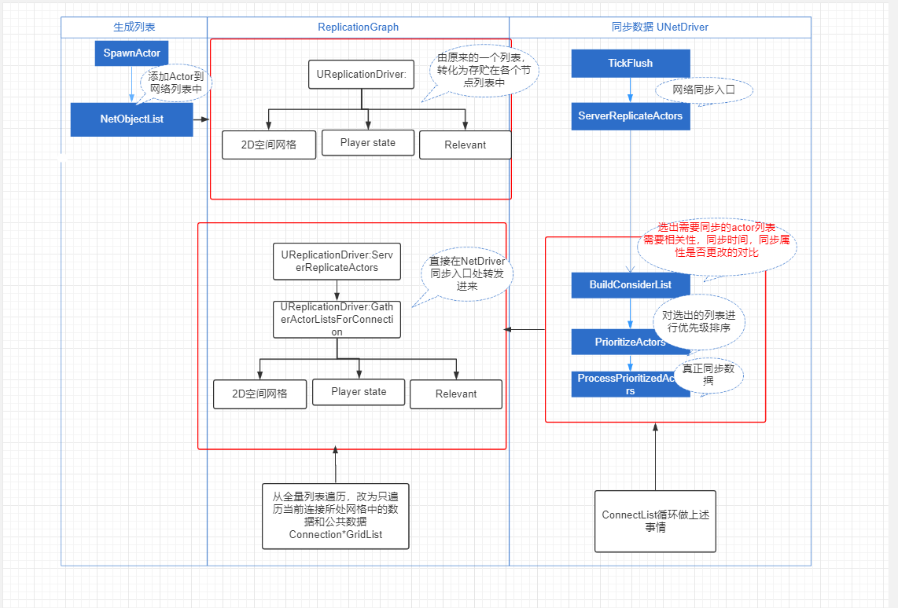
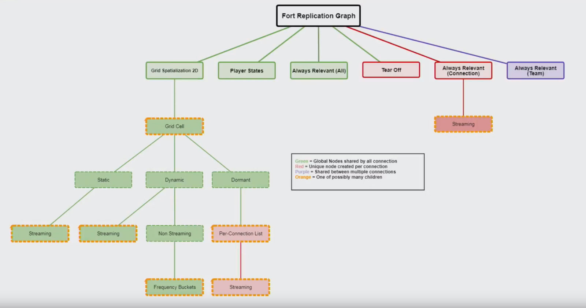

# ReplicationGraph
## 总体思路
根据类型和状态对Actor进行节点划分，每次针对当前Connection只检查所在Grid内对象的信息来大大降低整个Replication的计算量，节省CPU时间。

结构图

* UReplicationGraph:同步图表，NetDriver的网络分发路口
* GridSpatialization2D:按照2D空间划分的同步节点。
* PlayerState:与状态有关的节点，比如限制更新频率的对象
* AlwaysRelevant(All):与所有的链接都有相关性
* Tear Off:类似于OwnerRelevant,只同步给主客户端，不同步给模拟客户端。
* AlwaysRelevant(Connection):只与某一链接具有相关性，比如走进某一区域点亮一盏灯，只对这个链接有作用。
* AlwaysRelevant(Team):与队友相关的链接，比如复活次数等等。
* Static:静态同步对象(可破环物体)
* Dynamic:可以移动的同步对象
* Dormant:休眠对象。
* Streaming:和关卡有关的对象，只有关卡加载了才会进行同步。

## 过程
1. 添加
   生成Actor的时候通过调用各个类型节点的AddNetworkActor,分发Actor的存储。
   ~~~c++
   void UNetDriver::AddNetworkActor(AActor* Actor)
    {
        if (!IsDormInitialStartupActor(Actor))
	    {
		    GetNetworkObjectList().FindOrAdd(Actor, this);
		    if (ReplicationDriver)
		    {
			    ReplicationDriver->AddNetworkActor(Actor);
		    }
	    }
    }
   ~~~
2. 